<div align="center">


# 🧭 MarketScout

### Evidence-aware, multi-agent market intelligence for strategic decisions

**Transform a company name into a structured expansion thesis, competitive perspective, and printable research report.**

[Quick Start](#-quick-start) · [Architecture](#-architecture) · [API Reference](#-api-reference) · [Developers](#-developers) · [Contributing](#-contributing)

[](https://www.python.org/)
[](https://langchain-ai.github.io/langgraph/)
[](https://fastapi.tiangolo.com/)
[](https://modelcontextprotocol.io/)
[](https://docs.pydantic.dev/)
[](https://docs.astral.sh/uv/)
[](https://github.com/Ambitus-Intelligence/ambitus-ai-models/blob/main/LICENSE)
[](https://github.com/Ambitus-Intelligence/ambitus-ai-models/actions/workflows/python-publish.yml)
[](#-contributing)
[](#-developers)

</div>

> [!NOTE]
> **MarketScout accelerates research; it does not make decisions.** Validate material claims, calculations, source quality, and recommendations before using output in a customer, investment, clinical, legal, or regulatory decision.

---

## 📚 Table of Contents

- [What is MarketScout?](#-what-is-marketscout)
- [Key Capabilities](#-key-capabilities)
- [Architecture](#-architecture)
- [Quick Start](#-quick-start)
- [Configuration](#-configuration)
- [Usage](#-usage)
- [API Reference](#-api-reference)
- [Agents](#-agents)
- [Data Contracts](#-data-contracts)
- [Reliability, Security, and Responsible Use](#-reliability-security-and-responsible-use)
- [Development](#-development)
- [Operations](#-operations)
- [Repository Map](#-repository-map)
- [Extensibility](#-extensibility)
- [Roadmap](#-roadmap)
- [Developers](#-developers)
- [Contributing](#-contributing)
- [FAQ](#-faq)
- [License and Contacts](#-license-and-contacts)

---

## 🔭 What is MarketScout?

MarketScout is a Python market-research platform that coordinates specialized AI agents through a typed [LangGraph](https://langchain-ai.github.io/langgraph/) workflow. It takes a target company and optionally a target domain, researches the company, identifies expansion domains, gathers market and competitive evidence in parallel, identifies market gaps, prioritizes opportunities, and renders a citation-rich PDF research report.

| Interface | Best For | Entry Point |
|---|---|---|
| 🖥️ Rich terminal UI | Guided exploration and individual agent runs | `marketscout tui` |
| ⌨️ Click CLI | Repeatable local research and report export | `marketscout pipeline` |
| 🌐 FastAPI | Product integration and programmatic workflows | `marketscout api` |

| Provider | Default Model | When to Choose It |
|---|---|---|
| OpenAI | `o4-mini` | Hosted model access through an environment-held API key |
| Ollama | `qwen2.5:7b` | A locally running model endpoint and local-first experimentation |

> [!TIP]
> Use `--domain` when the research scope is already agreed. Omit it to let the graph pause after industry analysis and choose from ranked domains.

---

## ✨ Key Capabilities

| Capability | Description |
|---|---|
| 🧩 Specialized pipeline stages | Company, industry, market, competition, gaps, opportunities, and report synthesis. |
| 🙋 Human-in-the-loop selection | Domain selection using a first-class LangGraph interrupt and resume. |
| ⚡ Parallel evidence gathering | Market-data and competitive-landscape research with an explicit graph join. |
| ✅ Strict data contracts | Pydantic-validated request, response, configuration, and agent-output contracts. |
| 🔄 Model portability | OpenAI/Ollama portability through `config.toml`. |
| 🛠️ Tool exposure | FastMCP tools for search, citation verification, and connectivity. |
| 📤 Multi-surface output | CLI, Rich TUI, FastAPI, and PDF output from a common core workflow. |

---

## 🏗 Architecture

### Platform Topology

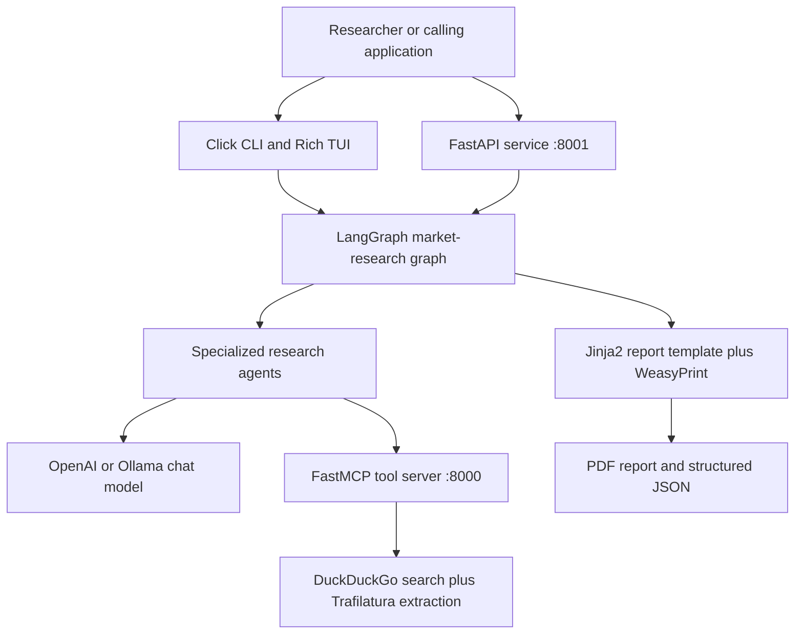

### Runtime Topology

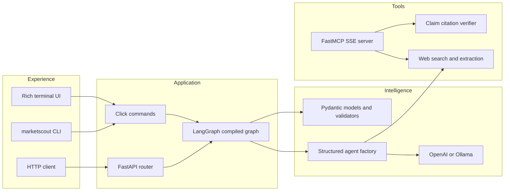

### Research Workflow

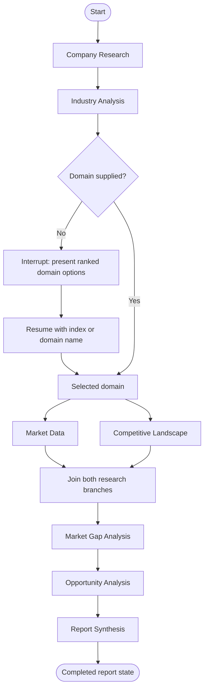

### Agent Execution and Evidence Flow

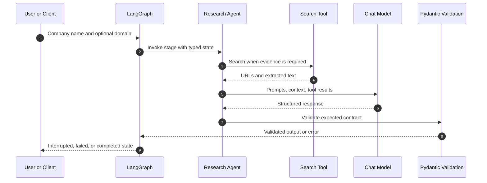

### Human-in-the-Loop Domain Selection

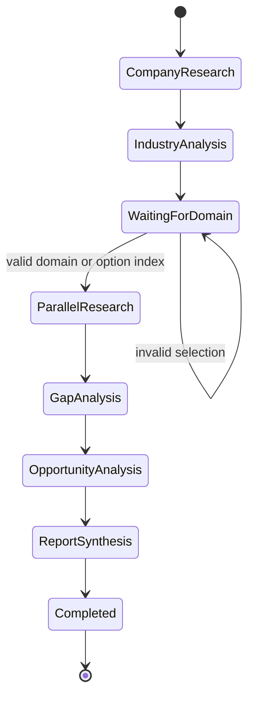

The current checkpointer is `InMemorySaver`. A paused pipeline is resumable only from the same live Python process and its original `thread_id`.

> [!WARNING]
> Restarting the CLI or API process discards interrupted runs. Replace the in-memory checkpointer with a durable LangGraph backend before multi-worker or production deployment.

### Parallel Branch Synchronization

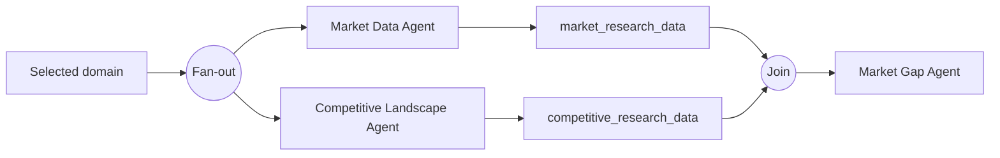

### State and Data Contracts

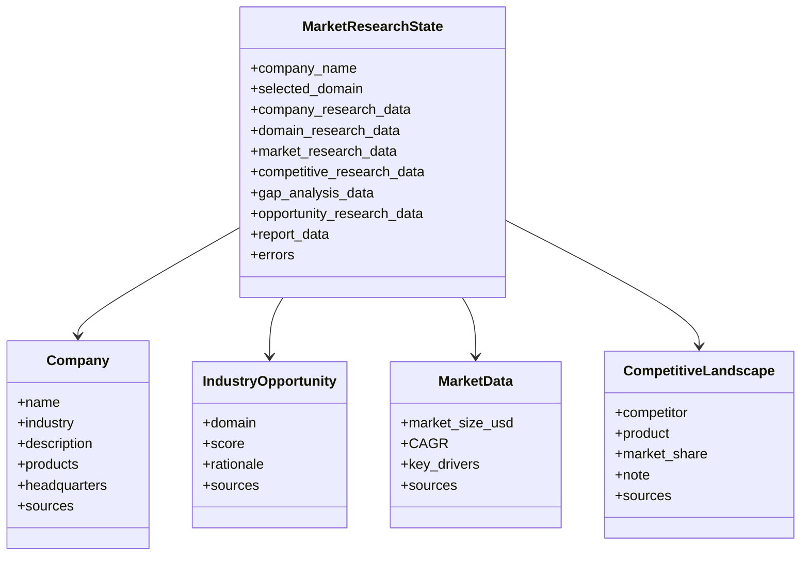

### Service and Tool Boundaries

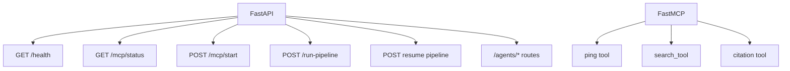

### Provider Selection

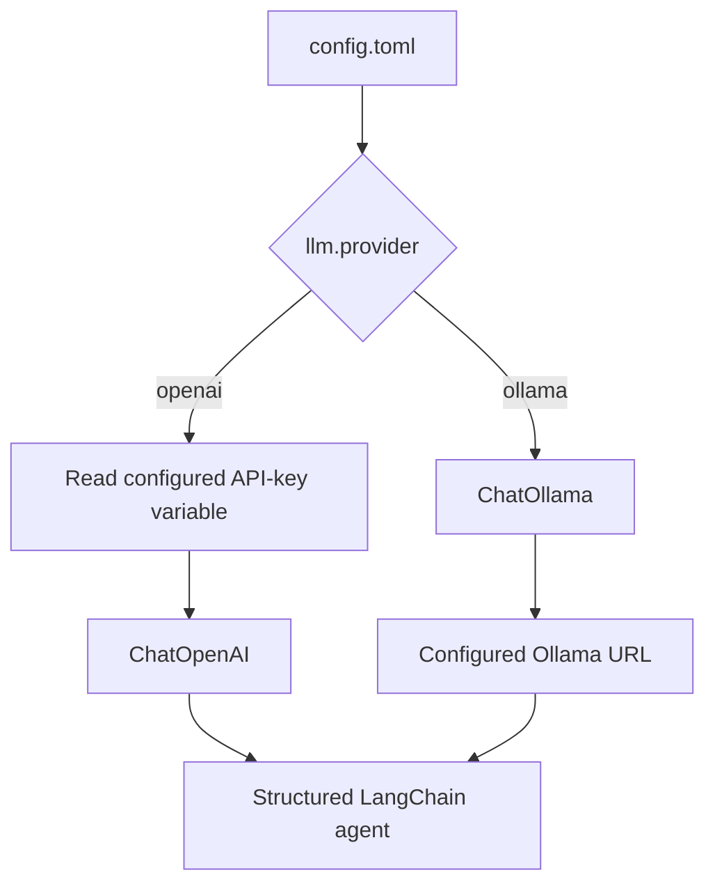

### Report-Generation Path

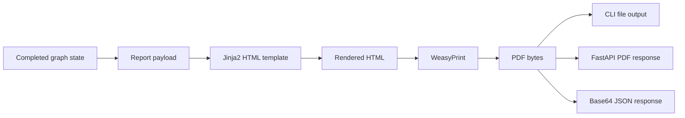

### Failure Propagation

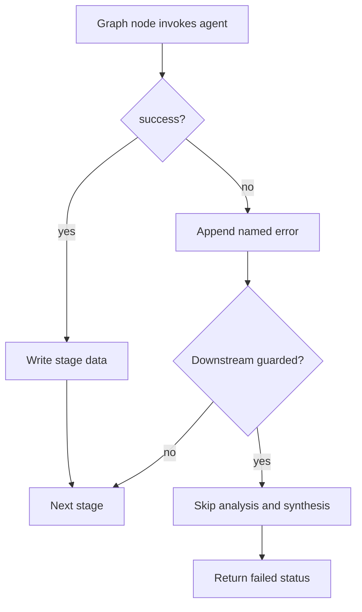

### Local Deployment View

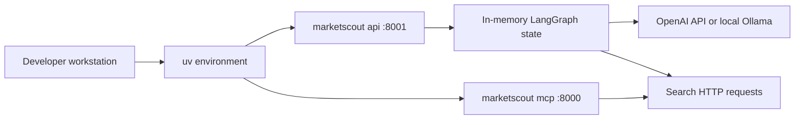

---

## 🚀 Quick Start

### 1. Install

MarketScout requires Python 3.11+ and [uv](https://docs.astral.sh/uv/).

```bash
git clone https://github.com/Ambitus-Intelligence/ambitus-ai-models.git
cd ambitus-ai-models
uv sync
```

### 2. Configure a Provider

```bash
cp .env.template .env
```

```dotenv
OPENAI_API_KEY="your-api-key"
```

```toml
[llm]
provider = "openai"

[llm.openai]
model = "o4-mini"
api_key_env = "OPENAI_API_KEY"
```

### 3. Run Research

```bash
uv run marketscout pipeline "OpenAI" --domain "Healthcare AI" --output report.pdf --format pdf
```

> [!TIP]
> In Windows PowerShell, use `Copy-Item .env.template .env` if `cp` is unavailable.

---

## ⚙️ Configuration

| Source | Purpose | Precedence |
|---|---|---|
| `config.toml` | Provider, model, endpoint, temperature | Default |
| `MARKETSCOUT_CONFIG` | Alternate TOML path | Overrides default config location |
| `.env` / process environment | Credentials | Used for the key named by `api_key_env` |

Restart the CLI, API, or TUI after changing configuration.

### OpenAI

```toml
[llm]
provider = "openai"

[llm.openai]
model = "o4-mini"
api_key_env = "OPENAI_API_KEY"
```

The key is deliberately not stored in `config.toml`.

### Ollama

```bash
ollama pull qwen2.5:7b
ollama serve
```

```toml
[llm]
provider = "ollama"

[llm.ollama]
model = "qwen2.5:7b"
base_url = "http://localhost:11434"
temperature = 0.0
```

> [!NOTE]
> Ollama mode does not require `OPENAI_API_KEY`. Tool calling and structured-output reliability vary by installed model and Ollama version.

### Alternate Configuration

```powershell
$env:MARKETSCOUT_CONFIG = "C:\research-config\marketscout.toml"
uv run marketscout pipeline "Contoso" --domain "Industrial AI"
```

---

## 🧭 Usage

### Terminal UI

```bash
uv run marketscout tui
uv run marketscout run
```

`tui` launches the guided terminal experience. `run` launches the individual-agent runner directly.

### Command-Line Pipeline

```bash
# Let MarketScout rank domains, then choose one interactively.
uv run marketscout pipeline "OpenAI"

# Supply a domain to skip the interrupt.
uv run marketscout pipeline "OpenAI" --domain "Healthcare AI"

# Write the synthesized report.
uv run marketscout pipeline "OpenAI" --domain "Healthcare AI" --output reports/openai-healthcare.pdf --format pdf

# Write machine-readable graph output.
uv run marketscout pipeline "OpenAI" --domain "Healthcare AI" --output artifacts/openai.json --format json
```

| Command | Description |
|---|---|
| `marketscout tui` | Open the terminal UI. |
| `marketscout run` | Start the individual agent runner. |
| `marketscout pipeline COMPANY` | Execute the complete LangGraph workflow. |
| `marketscout api` | Start FastAPI on port 8001 by default. |
| `marketscout mcp` | Start FastMCP SSE on port 8000 by default. |
| `marketscout both` | Start API and MCP services together. |

<details>
<summary><strong>Pipeline options</strong></summary>

| Option | Values | Meaning |
|---|---|---|
| `--domain` | Domain string | Skips interactive domain selection. |
| `--output`, `-o` | File path | Writes output and creates parent directories. |
| `--format` | `json`, `markdown`, `pdf` | Controls output serialization. |

</details>

> [!WARNING]
> The current `markdown` output option serializes JSON; use `pdf` for the templated report or `json` for a machine-readable result.

### FastAPI Service

```bash
uv run marketscout api --host 0.0.0.0 --port 8001
curl http://localhost:8001/health
curl http://localhost:8001/mcp/status
curl -X POST http://localhost:8001/mcp/start
```

Open interactive documentation at [http://localhost:8001/docs](http://localhost:8001/docs).

### FastMCP Tool Server

```bash
uv run marketscout mcp --host localhost --port 8000
```

| Tool | Purpose |
|---|---|
| `ping_tool` | Basic connectivity check. |
| `search_tool` | DuckDuckGo search with up to five URLs and extracted page text. |
| `claim_context_based_citation_tool` | Validates a claim against context and returns citations. |

---

## 🔌 API Reference

| Method | Route | Purpose |
|---|---|---|
| `POST` | `/run-pipeline` | Start a graph invocation. |
| `POST` | `/run-pipeline/{thread_id}/resume` | Resume an interrupted invocation. |
| `GET` | `/health` | API health and MCP availability. |
| `GET` | `/mcp/status` | MCP status and base URL. |
| `POST` | `/mcp/start` | Start MCP if not healthy. |

```bash
curl -X POST http://localhost:8001/run-pipeline \
  -H "Content-Type: application/json" \
  -d '{"company":"OpenAI"}'
```

An interactive run returns `status: "interrupted"`, `thread_id`, and ranked domain options. Resume it using an option index or a domain name:

```bash
curl -X POST http://localhost:8001/run-pipeline/THREAD_ID/resume \
  -H "Content-Type: application/json" \
  -d '{"domain":1}'
```

```bash
curl -X POST http://localhost:8001/run-pipeline \
  -H "Content-Type: application/json" \
  -d '{"company":"OpenAI","domain":"Healthcare AI"}'
```

| Agent | Execute | Input Schema | Output Schema |
|---|---|---|---|
| Company research | `POST /agents/company-research/` | `GET /agents/company-research/schema/input` | `GET /agents/company-research/schema/output` |
| Industry analysis | `POST /agents/industry-analysis/` | `GET /agents/industry-analysis/schema/input` | `GET /agents/industry-analysis/schema/output` |
| Market data | `POST /agents/market-data/` | `GET /agents/market-data/schema/input` | `GET /agents/market-data/schema/output` |
| Competitive landscape | `POST /agents/competitive-landscape/` | `GET /agents/competitive-landscape/schema/input` | `GET /agents/competitive-landscape/schema/output` |
| Market-gap analysis | `POST /agents/market-gap-analysis/` | `GET /agents/market-gap-analysis/schema/input` | `GET /agents/market-gap-analysis/schema/output` |
| Opportunity analysis | `POST /agents/opportunity/` | `GET /agents/opportunity/schema/input` | `GET /agents/opportunity/schema/output` |
| Report synthesis | `POST /agents/report-synthesis/` | `GET /agents/report-synthesis/schema/input` | `GET /agents/report-synthesis/schema/output` |

`POST /agents/report-synthesis/` returns a PDF. `POST /agents/report-synthesis/json` returns metadata plus base64 PDF data.

> [!NOTE]
> The OpenAPI document and schema endpoints are the live contracts; use them when integrating.

---

## 🤖 Agents

| Stage | Implementation | Input | Output | Search Enabled |
|---|---|---|---|---|
| Company Research | `company_research_agent.py` | Company name | `Company` | Yes |
| Industry Analysis | `industry_analysis_agent.py` | `Company` | `list[IndustryOpportunity]` | No |
| Market Data | `market_data_agent.py` | Domain | `MarketData` | Yes |
| Competitive Landscape | `competitive_landscape_agent.py` | `IndustryOpportunity` | `list[CompetitiveLandscape]` | Yes |
| Market Gap Analysis | `market_gap_agent.py` | Company, competitors, market stats | `list[MarketGap]` | No |
| Opportunity Analysis | `opportunity_agent.py` | Market gaps | `list[Opportunity]` | Yes |
| Report Synthesis | `report_synthesis_agent.py` | Aggregate research payload | PDF bytes and metadata | No |

Every research agent uses `src.agents.base.run_structured_agent()` for provider selection, LangChain agent construction, tool wiring, and structured result validation.

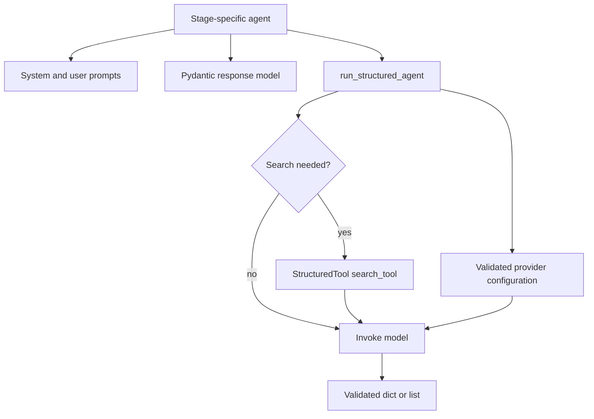

> [!WARNING]
> Report synthesis currently contains placeholder markers in its route implementation. It generates a PDF, but its route contract and report completeness should be treated as evolving.

---

## 📦 Data Contracts

| Model | Required Fields |
|---|---|
| `Company` | `name`, `industry`, `description`, `products`, `headquarters`, `sources` |
| `IndustryOpportunity` | `domain`, `score`, `rationale`, `sources` |
| `MarketData` | `market_size_usd`, `CAGR`, `key_drivers`, `sources` |
| `CompetitiveLandscape` | `competitor`, `product`, `market_share`, `note`, `sources` |
| `MarketGap` | `gap`, `impact`, `evidence`, `source` |
| `Opportunity` | `title`, `priority`, `description`, `sources` |

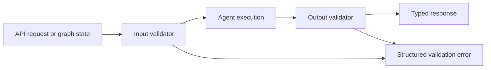

---

## 🛡 Reliability, Security, and Responsible Use

| Area | Current Behavior | Operational Implication |
|---|---|---|
| Graph persistence | `InMemorySaver` | Resume requires the same process. |
| Error accumulation | Named errors append to `state.errors` | Completion can return `failed` diagnostics. |
| Output shape | Pydantic validators | Invalid outputs are surfaced. |
| Search | Public DuckDuckGo HTML and extraction | Add caching and source policy controls for production. |
| Report bytes | Base64 in JSON responses | Decode before binary storage or serving. |

- Keep keys in `.env`, process environment, or a secret manager.
- Do not commit customer prompts, research payloads, reports, or credentials.
- Treat retrieved web content as untrusted, including prompt-injection content.
- Add authentication, authorization, rate limits, telemetry, and durable checkpointing before external deployment.

> [!IMPORTANT]
> MarketScout retrieves web content and sends selected context to the configured provider. Review privacy, retention, and acceptable-use requirements before processing confidential information.

### Evidence-Quality Checklist

- Verify every cited URL supports the exact claim.
- Prefer primary sources: filings, official statistics, documentation, and original research.
- Record access dates for time-sensitive facts.
- Distinguish reported facts from model-generated interpretation.
- Require qualified review for material recommendations.

---

## 🧪 Development

### Prerequisites

| Dependency | Required Version | Why It Is Needed |
|---|---|---|
| Python | 3.11+ | Project runtime requirement. |
| uv | Current | Locked dependency synchronization. |
| OpenAI API key or Ollama | One provider | Agent model execution. |
| WeasyPrint system dependencies | Platform-dependent | PDF rendering. |

### Install and Verify

```bash
uv sync
uv run python -m unittest discover -s tests -v
```

The included tests cover provider selection, configured OpenAI-key lookup, Ollama model construction, LangGraph interrupt/resume behavior, parallel branch coordination, graph joining, and PDF-state serialization.

### Focused Test

```bash
uv run python -m unittest tests.test_langgraph_pipeline -v
```

### Test Strategy

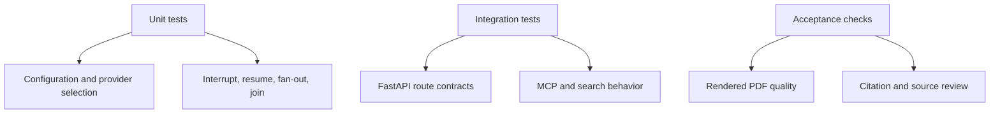

### Quality Checks

```bash
uv run ruff check src/ --exclude notebooks/
uv run ruff format --check src/ --exclude notebooks/
uv run mypy src/ --exclude notebooks/
uv run pytest tests/ -v --cov=src --cov-report=xml --ignore=notebooks/
```

> [!NOTE]
> The direct test suite uses `unittest`. The release workflow also invokes `pytest`, `ruff`, and `mypy`; ensure those developer tools are installed if reproducing every CI step locally.

### Build the Package

```bash
uvx --from build pyproject-build
uvx twine check dist/*
```

The package provides the `marketscout` console entry point from `src.app:main`.

---

## 📈 Operations

### Service Startup

```bash
uv run marketscout mcp --host localhost --port 8000
uv run marketscout api --host localhost --port 8001
```

```bash
uv run marketscout both --mcp-host localhost --mcp-port 8000 --api-host localhost --api-port 8001
```

| Service | Port | Health Endpoint | Responsibility |
|---|---:|---|---|
| FastAPI | 8001 | `GET /health` | API, pipeline initiation/resume, agent endpoints. |
| FastMCP | 8000 | `GET /health` | SSE tool exposure and connectivity. |
| Ollama | 11434 default | Provider-managed | Local chat model serving when configured. |

### Production-Readiness Checklist

- [ ] Store secrets in a secret manager and inject them at runtime.
- [ ] Use a durable LangGraph checkpoint backend for resumable jobs.
- [ ] Add API authentication and authorization.
- [ ] Place the API behind TLS and an ingress/reverse proxy.
- [ ] Add structured logs, metrics, tracing, and alerting.
- [ ] Add correlation IDs across API, graph, agent, and tool calls.
- [ ] Define retries, timeouts, backoff, and circuit breakers for models and retrieval.
- [ ] Cache or curate trusted sources where appropriate.
- [ ] Define retention and report-storage policies.
- [ ] Validate PDFs and citations before distribution.

### Release Flow

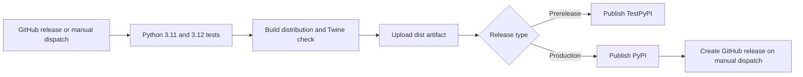

The included release workflow tests on Python 3.11 and 3.12, builds the distribution, performs a Twine check, and supports TestPyPI/PyPI trusted publishing.

---

## 🗂 Repository Map

```text
ambitus-ai-models/
├── .github/workflows/          # Publishing workflow
├── config.toml                 # Provider selection and settings
├── docs/                       # System notes and product assets
├── notebooks/                  # Experiments and research notebooks
├── src/
│   ├── agents/                 # Specialized agents and shared runtime
│   ├── api/                    # FastAPI application and route modules
│   ├── cli/                    # Click commands and Rich TUI
│   ├── mcp_server/             # FastMCP server and tool implementations
│   ├── pipeline/                # State and LangGraph workflow
│   └── utils/                  # Config, schemas, validation, PDF template
├── tests/                       # Provider and graph behavior tests
├── main.py                     # Direct Python entry point
├── pyproject.toml               # Package metadata and dependencies
└── uv.lock                     # Locked dependency graph
```

| Path | Responsibility |
|---|---|
| [`src/pipeline/pipeline.py`](src/pipeline/pipeline.py) | Nodes, edges, interrupt, serialization, and resume. |
| [`src/pipeline/state.py`](src/pipeline/state.py) | Typed shared graph state. |
| [`src/agents/base.py`](src/agents/base.py) | Provider construction and structured agent runner. |
| [`src/utils/config.py`](src/utils/config.py) | TOML configuration loading and validation. |
| [`src/utils/models.py`](src/utils/models.py) | Pydantic data, request, and response contracts. |
| [`src/api/router.py`](src/api/router.py) | FastAPI app and pipeline routes. |
| [`src/mcp_server/server.py`](src/mcp_server/server.py) | FastMCP registration and SSE startup. |
| [`src/utils/report_template.html`](src/utils/report_template.html) | HTML template for PDF rendering. |

---

## 🧩 Extensibility

### Add a Research Agent

1. Define a Pydantic response model in `src/utils/models.py`.
2. Add a stage implementation under `src/agents/` using `run_structured_agent()`.
3. Add state fields only when stage output must persist across nodes.
4. Add the node and edges in `build_market_research_graph()`.
5. Define validators in `src/utils/validation.py`.
6. Add a route module and include it from `src/api/routes/__init__.py` if standalone API access is needed.
7. Add success, schema-failure, ordering, and interrupt tests.

### Add an MCP Tool

1. Implement a function under `src/mcp_server/tools/`.
2. Use a stable function name and accurate docstring as tool metadata.
3. Import and register it in `src/mcp_server/server.py`.
4. Test directly and through an MCP client.
5. Consider timeouts, input validation, authentication, source trust, and error redaction.

### Add a Model Provider

1. Extend `LLMSettings` and its configuration schema.
2. Update `create_chat_model()` in `src/agents/base.py`.
3. Preserve the `BaseChatModel` contract required by `create_agent()`.
4. Add focused tests for parsing and model construction.
5. Document credentials, endpoint format, and structured-output behavior.

> [!TIP]
> Keep side effects at the edges. Agents should return structured success/error results; orchestration owns graph order and cross-stage state.

---

## 🛣 Roadmap

- Durable checkpointing across process restarts and workers.
- Authentication, authorization, and audit logging for FastAPI.
- Curated sources, provenance metadata, caching, and citation scoring.
- Asynchronous jobs, progress streaming, and cancellation.
- Stabilized report-generation contracts and non-placeholder synthesis routes.
- Expanded API, MCP, retrieval-failure, and PDF integration coverage.
- Production telemetry for latency, usage, errors, source quality, and outcomes.
- Configurable research templates and domain-specific agent packs.

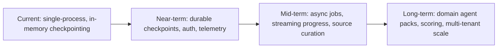

---

## 👩‍💻 Developers

MarketScout is designed, built, and maintained by the following core contributors. Reach out through GitHub issues or discussions for questions about architecture, extensibility, or roadmap direction.

<div align="center">

| Developer | Role | GitHub |
|---|---|---|
| **Nishant Sharma** | Core Maintainer · AI Systems & Backend Architecture | [@NishantSharma](https://github.com/) |
| **Sanyam Jain** | Core Maintainer · Platform Engineering & Integrations | [@SanyamJain](https://github.com/) |

</div>

> [!NOTE]
> GitHub profile links above are placeholders — update them with the actual GitHub usernames of Nishant Sharma and Sanyam Jain before publishing.

### Maintainer Responsibilities

| Area | Owner Focus |
|---|---|
| LangGraph pipeline design, agent orchestration, and state contracts | Core AI/backend architecture |
| FastAPI service, FastMCP tool server, and CLI/TUI experience | Platform engineering and developer experience |
| Release engineering, CI/CD, and packaging | Shared |
| Documentation and contributor enablement | Shared |

### Getting in Touch

- Open a [GitHub Issue](../../issues) for bugs, feature requests, or questions.
- Start a [GitHub Discussion](../../discussions) for architecture proposals or design conversations.
- Tag a maintainer on a pull request for a focused review.

> [!TIP]
> If you are evaluating MarketScout for adoption in your organization, open a discussion describing your use case — it helps prioritize the roadmap.

---

## 🤝 Contributing

Contributions that improve research quality, correctness, usability, reliability, documentation, or operational safety are welcome.

1. Create a focused branch from the default branch.
2. Keep unrelated formatting or generated-file changes out of the pull request.
3. Add or update tests for behavior changes.
4. Run relevant validation commands locally.
5. Update docs when a public interface changes.
6. Describe evidence, limitations, migration steps, and operational implications.

### Contribution Flow

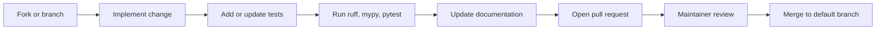

### Pull-Request Checklist

- [ ] The change has a focused purpose and clear title.
- [ ] Public behavior has tests or a documented testing limitation.
- [ ] Agent outputs remain schema-valid and error behavior is explicit.
- [ ] No credential, personal, customer, or proprietary data is included.
- [ ] New retrieval sources were evaluated for trust, licensing, and availability.
- [ ] API, MCP, and CLI changes include migration notes.
- [ ] Documentation reflects the implementation that ships.

---

## ❓ FAQ

<details>
<summary><strong>Does MarketScout work without an internet connection?</strong></summary>

No. Research agents rely on live web search and extraction for evidence. Only the report-rendering step operates entirely offline once research data has been gathered.

</details>

<details>
<summary><strong>Can I use MarketScout entirely with a local model?</strong></summary>

Yes. Configure the `ollama` provider in `config.toml` and run a local Ollama server. No `OPENAI_API_KEY` is required in this mode, though structured-output reliability depends on the installed model.

</details>

<details>
<summary><strong>What happens if I restart the API while a pipeline is interrupted?</strong></summary>

The interrupted run is lost. The default checkpointer (`InMemorySaver`) only persists state in the running process's memory. Use a durable LangGraph checkpoint backend for production resilience.

</details>

<details>
<summary><strong>Is the generated PDF report production-ready?</strong></summary>

Treat it as evolving. The report-synthesis route currently contains placeholder markers; verify report completeness and citation accuracy before external distribution.

</details>

<details>
<summary><strong>How do I add support for a new LLM provider?</strong></summary>

See [Add a Model Provider](#add-a-model-provider) in the Extensibility section for the full checklist.

</details>

---

## 📄 License and Contacts

See the repository's [license information](LICENSE) for usage terms.

MarketScout is part of the Research Intelligence product-research ecosystem, maintained by **Nishant Sharma** and **Sanyam Jain**. Open a GitHub issue or discussion for questions, feature requests, and contribution coordination.

<div align="center">

Built for research teams who want a clear path from evidence to opportunity.

**Maintained with ❤️ by Nishant Sharma and Sanyam Jain**

</div>
